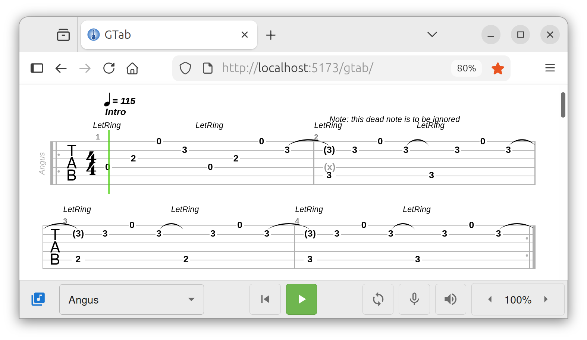

# GTab

GTab is an online guitar tablature viewer and player (JavaScript-based).

[View GTab demo](https://applane.github.io/gtab/)

### Features

- View and play a guitar tablature from a server-side library of tablatures.
- Load a local tablature file (Guitar Pro .gp3+, .gpx).
- Select a track to play and set its volume, mute, solo properties.
- Select beats with the mouse and loop them to learn riffs and sequences.
- Slow down the song for easy learning.

#### Desktop

#### Mobile

